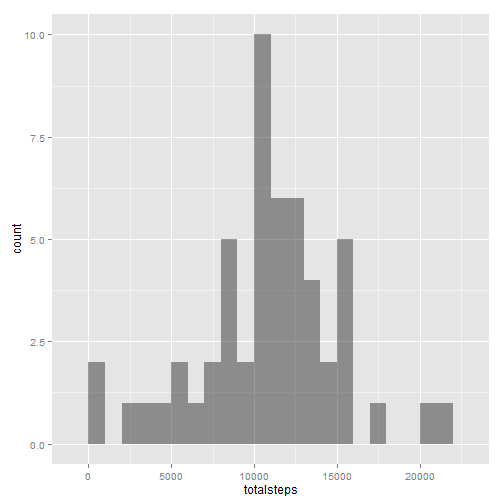
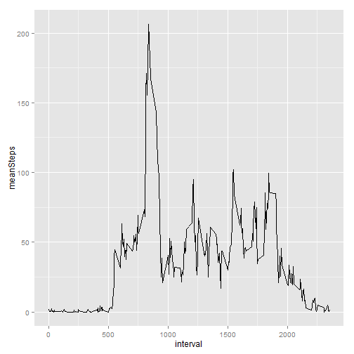
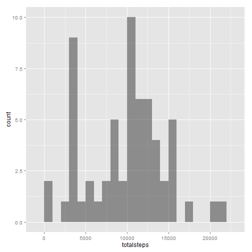
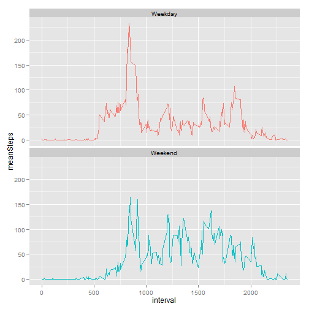
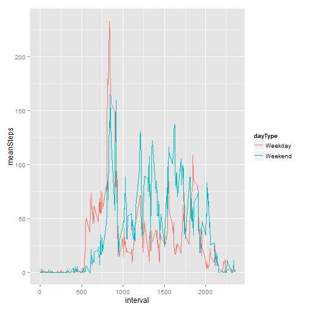

## Peer Assessment 1

### 1. Loading and cleaning the Data

Ensure that the code is always visible.

```r
knitr::opts_chunk$set(echo=TRUE)
```

Load the necessary libraries.

```r
library(data.table)
```

```
## data.table 1.9.2  For help type: help("data.table")
```

```r
library(ggplot2)
library(xtable)
library(VIM)
```

```
## Loading required package: colorspace
## Loading required package: grid
## VIM is ready to use. 
##  Since version 4.0.0 the GUI is in its own package VIMGUI.
## 
##           Please use the package to use the new (and old) GUI.
## 
## 
## Attaching package: 'VIM'
## 
## The following object is masked from 'package:datasets':
## 
##     sleep
```
The data is read from a CSV file activity.csv located in the folder "C:/Users/SUPER JG/Documents/Coursera Data Science/Reproducible Research/Peer assessment 1/Data/activity.csv"


```r
activityData<-read.csv("C:/Users/SUPER JG/Documents/Coursera Data Science/ReproducibleResearch/Peer assessment 1/Data/activity.csv")
```
Examine the first lines of data using str(), head() and summary().

```r
head(activityData)
```

```
##   steps       date interval
## 1    NA 2012-10-01        0
## 2    NA 2012-10-01        5
## 3    NA 2012-10-01       10
## 4    NA 2012-10-01       15
## 5    NA 2012-10-01       20
## 6    NA 2012-10-01       25
```

```r
summary(activityData)
```

```
##      steps               date          interval   
##  Min.   :  0.0   2012-10-01:  288   Min.   :   0  
##  1st Qu.:  0.0   2012-10-02:  288   1st Qu.: 589  
##  Median :  0.0   2012-10-03:  288   Median :1178  
##  Mean   : 37.4   2012-10-04:  288   Mean   :1178  
##  3rd Qu.: 12.0   2012-10-05:  288   3rd Qu.:1766  
##  Max.   :806.0   2012-10-06:  288   Max.   :2355  
##  NA's   :2304    (Other)   :15840
```

```r
str(activityData)
```

```
## 'data.frame':	17568 obs. of  3 variables:
##  $ steps   : int  NA NA NA NA NA NA NA NA NA NA ...
##  $ date    : Factor w/ 61 levels "2012-10-01","2012-10-02",..: 1 1 1 1 1 1 1 1 1 1 ...
##  $ interval: int  0 5 10 15 20 25 30 35 40 45 ...
```

This indicates the presence of NA values and the date format will be modified from Factor to Date.But first, save the data as a data table.

```r
activityDataTable<-data.table(activityData)
```
Convert the dates to a Date class.

```r
activityDataTable[, date := as.Date(date)]
```

```
##        steps       date interval
##     1:    NA 2012-10-01        0
##     2:    NA 2012-10-01        5
##     3:    NA 2012-10-01       10
##     4:    NA 2012-10-01       15
##     5:    NA 2012-10-01       20
##    ---                          
## 17564:    NA 2012-11-30     2335
## 17565:    NA 2012-11-30     2340
## 17566:    NA 2012-11-30     2345
## 17567:    NA 2012-11-30     2350
## 17568:    NA 2012-11-30     2355
```
### 2. What is mean total number of steps taken per day?

For this part of the assignment, you can ignore the missing values in the dataset.

**1. Make a histogram of the total number of steps taken each day**

Find the number of steps for each day. Days with missing values will have NA.

```r
dailySteps<-activityDataTable[,list(totalsteps=sum(steps)),date]
```
Examine the head of dailySteps:

```r
head(dailySteps)
```

```
##          date totalsteps
## 1: 2012-10-01         NA
## 2: 2012-10-02        126
## 3: 2012-10-03      11352
## 4: 2012-10-04      12116
## 5: 2012-10-05      13294
## 6: 2012-10-06      15420
```
Draw the required histogram using ggplot2.

```r
ggplot(dailySteps,aes(x=totalsteps)) + geom_histogram(alpha = 1/2, binwidth = 1000)
```

 

**2. Calculate and report the mean and median total number of steps taken per day**

The median and the mean are calculated before imputing the NA values.

```r
medMean<-dailySteps[,list(n = .N, nValid = sum(!is.na(totalsteps)), mean = mean(totalsteps,na.rm = TRUE), median = median(totalsteps, na.rm = TRUE))]
```
The mean and median:

```r
medMean
```

```
##     n nValid  mean median
## 1: 61     53 10766  10765
```
NB: I tried to use xtable, but it did not work. Tried the presentation examples, also did not work. I will inquire when time permits....

### 3. What is the average daily pattern?

**1. Make a time series plot (i.e. type = "l") of the 5-minute interval (x-axis) and the average number of steps taken, averaged across all days (y-axis)**

The initial table activityDataTable includes 5 minute intervals.Use these intervals to make the required plot.

```r
ADTIntervals<-activityDataTable[,list(meanSteps=mean(steps,na.rm=TRUE)),interval]
```
Create the plot again using ggplot2 of the 5 minute intervals and the average number of steps takewn across the days.

```r
ggplot(ADTIntervals,aes(x=interval,y=meanSteps))+geom_line()
```

 

**2. Which 5-minute interval, on average across all the days in the dataset, contains the maximum number of steps?**

In first place, find the maximum value of meanSteps in ADTIntervals.

```r
maxStep<-max(ADTIntervals$meanSteps)
```
Then find which interval matches this value.

```r
ADTIntervals[which(ADTIntervals$meanSteps==maxStep)]
```

```
##    interval meanSteps
## 1:      835     206.2
```
### 4. Imputing missing values

Note that there are a number of days/intervals where there are missing values (coded as NA). The presence of missing days may introduce bias into some calculations or summaries of the data.

**1. Calculate and report the total number of missing values in the dataset (i.e. the total number of rows with NAs).**

This can be done simply by summing the number of NAs in the steps colujmn of the table activityDataTable.

```r
sum(is.na(activityDataTable$step))
```

```
## [1] 2304
```

**2. Devise a strategy for filling in all of the missing values in the dataset. The strategy does not need to be sophisticated. For example, you could use the mean/median for that day, or the mean for that 5-minute interval, etc.**

A quick internet search has revealed the existence of the VIM package.
The following is part of the description for this package.   

"This package introduces new tools for the visualization of missing
and/or imputed values, which can be used for exploring the data and the
structure of the missing and/or imputed values".

As most of the examples examined involved the k-Nearest-Neighbour imputation, this same method will be used here. 

**3. Create a new dataset that is equal to the original dataset but with the missing data filled in.**

The function kNN() from the package VIM takes the original data and returns a new imputed data set.The time difference between the original data set and the imputed one is also given.


```r
imputedActivity<-kNN(activityDataTable)
```

```
## Time difference of -5.106 secs
```

A quick verification shows that no NA values are present in the new data set.

```r
suppressWarnings(sum(is.na(imputedActivity$step)))
```

```
## [1] 0
```

**4. Make a histogram of the total number of steps taken each day and Calculate and report the mean and median total number of steps taken per day. Do these values differ from the estimates from the first part of the assignment? What is the impact of imputing missing data on the estimates of the total daily number of steps?**

This section basically reproduces step 2.What is mean total number of steps taken per day for the new set.

Find the number of steps for each day. Days with missing values will have NA.

```r
dailyStepsImputed<-imputedActivity[,list(totalsteps=sum(steps)),date]
```

Draw the required histogram using ggplot2.

```r
ggplot(dailyStepsImputed,aes(x=totalsteps)) + geom_histogram(alpha = 1/2, binwidth = 1000)
```

 

The median and the mean are now calculated for the imputed set.

```r
medMeanImputed<-dailyStepsImputed[,list(n = .N, nValid = sum(!is.na(totalsteps)), mean = mean(totalsteps,na.rm = TRUE), median = median(totalsteps, na.rm = TRUE))]
```
The mean and median:

```r
medMeanImputed
```

```
##     n nValid mean median
## 1: 61     61 9752  10395
```
This can be compared with the original values before imputing:

```r
medMean
```

```
##     n nValid  mean median
## 1: 61     53 10766  10765
```
The difference between the 2 sets is given by

```r
medMean - medMeanImputed
```

```
##    n nValid mean median
## 1: 0     -8 1014    370
```

Comparing these values shows that the median for the imputed set is approximately the same as the median of the original set, whereas the difference for the means is significantly larger.  
One can thus estimate the impact of imputing missing data as lowering the estimates of the numbers of steps taken each day.

### 5. Are there differences in activity patterns between weekdays and weekends?

For this part the weekdays() function may be of some help here. Use the dataset with the filled-in missing values for this part (imputedActivity).  
**1. Create a new factor variable in the dataset with two levels -- "weekday" and "weekend" indicating whether a given date is a weekday or weekend day.**

```r
dayLevels<-c("Sunday", "Monday", "Tuesday", "Wednesday", "Thursday", "Friday",   "Saturday")
weekLevels<-c("Weekend", rep("Weekday", 5), "Weekend")
imputedActivity<-imputedActivity[, `:=`(dayOfWeek, factor(weekdays(date), levels = dayLevels))]
imputedActivity<-imputedActivity[, `:=`(dayType, factor(weekLevels[dayOfWeek]))]
imputedActivity[, .N, list(dayType, dayOfWeek)]
```

```
##    dayType dayOfWeek    N
## 1: Weekday    Monday 2592
## 2: Weekday   Tuesday 2592
## 3: Weekday Wednesday 2592
## 4: Weekday  Thursday 2592
## 5: Weekday    Friday 2592
## 6: Weekend  Saturday 2304
## 7: Weekend    Sunday 2304
```
Verify that they are factors.

```r
message(sprintf("Is dayOfWeek a factor? %s. Is dayType a factor? %s", is.factor(imputedActivity$dayOfWeek),is.factor(imputedActivity$dayType)))
```

```
## Is dayOfWeek a factor? TRUE. Is dayType a factor? TRUE
```
**2. Make a panel plot containing a time series plot (i.e. type = "l") of the 5-minute interval (x-axis) and the average number of steps taken, averaged across all weekday days or weekend days (y-axis).**  
This is the same as section 3.1 for the new data set over weekdays and weekends.

```r
ADTIntervalsImputed<-imputedActivity[, list(meanSteps = mean(steps, na.rm = TRUE)), list(dayType, interval)]
```

Create 2 time series plots of the 5-minute intervals and average number of steps taken, one for the week and one for the weekend.

```r
ggplot(ADTIntervalsImputed,aes(x=interval,y=meanSteps,color=dayType))+ geom_line() + 
facet_wrap(~dayType, nrow = 2) + theme(legend.position = "none")
```

 

Create a single plot with the 2 time series for clarity.

```r
ggplot(ADTIntervalsImputed,aes(x=interval,y=meanSteps,color=dayType))+ geom_line()
```

 


